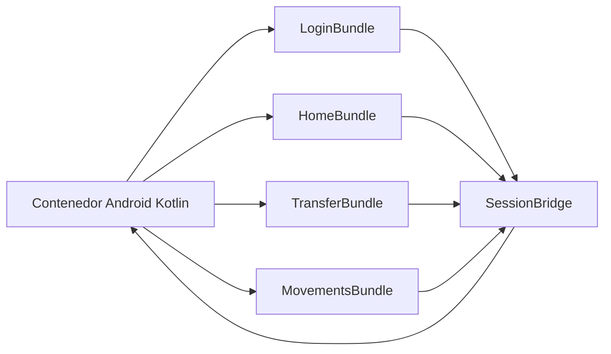
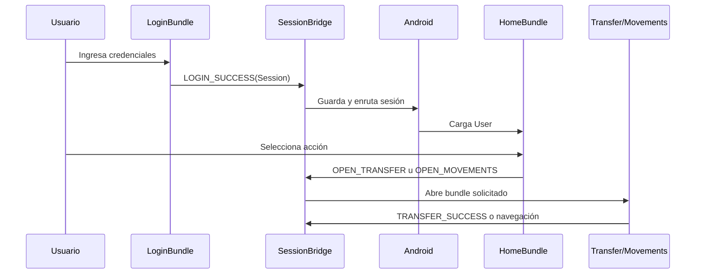

# Arquitectura

Cada bundle mantiene `screens/`, `services/` y `hooks/`. Los servicios contienen los datos de desarrollo y el manejo de errores; las pantallas solo coordinan estado y presentación. `shared/theme` contiene tokens visuales, contratos de dominio y el componente de movimiento reutilizable.

## Flujo principal

## Seguridad diseñada, pendiente de implementación

- La sesión debe guardarse con una clave del Android Keystore y `EncryptedSharedPreferences`; nunca en texto plano ni en logs.
- Los builds de producción deben activar ProGuard/R8 y conservar reglas mínimas para React Native y el bridge.
- La detección de root y emulador puede bloquear o elevar el nivel de autenticación, pero es una capa adicional y no reemplaza controles de servidor.
- `Session.expiresAt` define la expiración; Android debe validar ese valor al reanudar la app y emitir `SESSION_EXPIRED`.

El módulo Kotlin entregado es una prueba de concepto: recibe y registra eventos, pero todavía no implementa almacenamiento cifrado ni navegación completa entre raíces React Native.