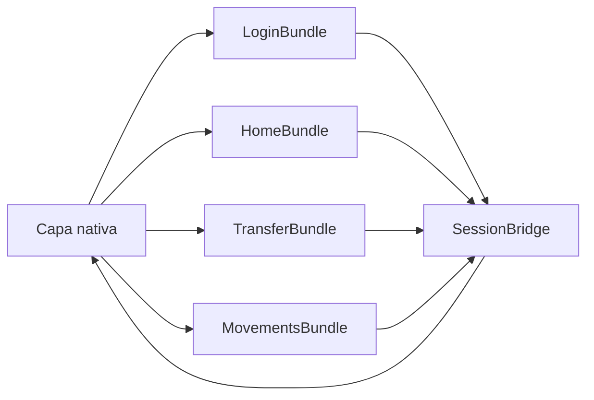
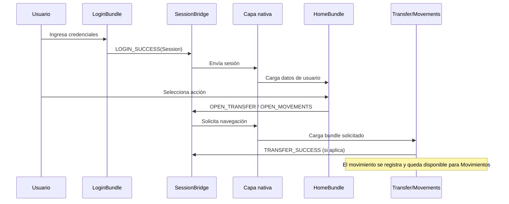
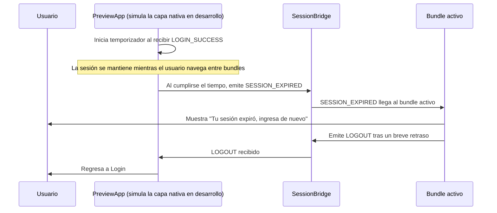

# Arquitectura

La aplicación está organizada en cuatro bundles independientes de React Native: Login,
Home, Transferencia y Movimientos.

Cada bundle mantiene su propia estructura de `screens/`, `services/` y `hooks/`. Los
servicios manejan los datos de desarrollo y los errores, mientras que las pantallas se
encargan principalmente de la presentación y coordinación del estado.

`shared/theme` centraliza los estilos, tokens visuales y contratos de datos compartidos
entre los bundles.

## Flujo principal

## Expiración de sesión

En desarrollo, `PreviewApp.tsx` simula el rol que tendría la capa nativa: controla la
duración de la sesión y reacciona a su expiración. En una implementación completa, esta
responsabilidad debería trasladarse a la capa nativa para centralizar la gestión de la
sesión.

## Seguridad

La arquitectura contempla que la gestión de la sesión y la comunicación entre la capa
nativa y React Native sean responsabilidad de la capa nativa.

Como parte del alcance de la prueba, estas medidas quedaron planteadas a nivel
arquitectónico y no como una implementación completa. La gestión segura de la sesión,
validación de acceso y protección de la comunicación entre capas quedan como pasos
posteriores.

El módulo Kotlin entregado es una prueba de concepto para demostrar la comunicación
mediante eventos. La navegación completa entre bundles y la gestión nativa de la
sesión quedan como pasos posteriores de implementación.